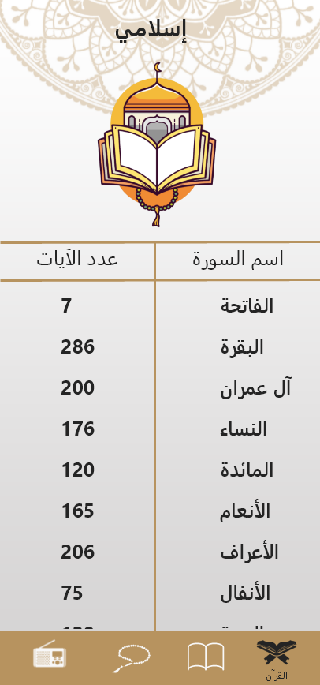

<div align="center">


# **Islami**

Islami is an app designed to provide users with access to the Quran and Hadith.


<br/>

</div>

## Features
- Read the full Quran in Arabic
- keep track of your tasbeeh with digital counter
- brows various Hadiths

## Screenshots

  
<br>
 

### Installing

1. Clone the repository
``` git clone https://github.com/ahmedmahgoub0/IslamiApp.git ```
2. Open the project in Android Studio
3. Build and run the app
